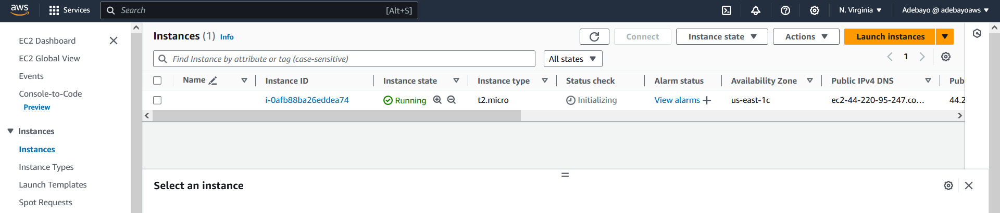
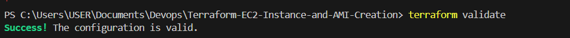

# Terraform-EC2-Instance-and-AMI-Creation

this is a mini project aimed to show my skill with automation through the creation of an EC2 instance on AWS and the creating and AMI image for the instance, i proceeded to also make changes to the recources created and lastly creating an EBS volume using the terraform tool.

### Installing Terraform
I install the terraform on my computer following the documentation on `https://developer.hashicorp.com/terraform/tutorials/aws-get-started/install-cli` as shown below  we confirm this has been installed on the system by running `terraform --help` as shown below 

### Installing CLI

To be able to access the provider we intend to create resources on (AWS) we need to install the specified `Command Line Interface (CLI)` for the provider we intend to use, either AWS, ORACLE CLOUD, AZURE or others. 

We proceed to search for the AWS CLI and install same as provided on `https://docs.aws.amazon.com/cli/latest/userguide/getting-started-install.html` as shown below  

On the AWS console i cick on the user details on the top right and proceed to click on the `security credentials` and proceed to click `create access key` to be able to commect the command line to the terraform tool.  we then select `command line interface CLI` and create access key  

We then copy the access key generated 

### Connecting to AWS
We then proceed to run the following commands
```
{
aws --version
aws configure
}
```

we then proceed to confirm connection by changing directory to the aws folder by running `.\aws\` and we run `cat credentials` as shown below 

using a preferred text edditor in thei case `(VSCode)` we open a terminal and create a folder `terrafor-EC2-AMI` in the folder we proceed to create a terraform file that ends with `tf` in this case `main.tf`. We then proceed to change directory to the terrafor-EC2-AMI folder and run `terraform init` as shown below .

we then proceed to paste the following configuration into the `main.tf` file 
```
{
provider "aws" {
  region = "us-east-1"  # Change this to your desired AWS region
}

resource "aws_instance" "example_instance" {
  ami           = "ami-04b70fa74e45c3917"  # Specify your desired AMI ID
  instance_type = "t2.micro"
  key_name      = "EC2-tutorial2"  # Specify your key pair name

  // Add other necessary configuration for your instance (e.g., subnet, security group, etc.)
}

resource "aws_ami_from_instance" "example_ami" {
  name               = "example-ami_for_terraform"
  description        = "Example AMI created with Terraform"
  source_instance_id = aws_instance.example_instance.id

  // Add any additional settings or configuration for your AMI
}
}
```
This Terraform configuration file sets up an EC2 instance and creates an AMI from that instance on AWS. It provides instructions on how to customize the AWS region, AMI ID, key pair name, and any additional configurations needed for the instance and AMI 
 as shown below 
we then proceed to rin the terraform run command `terraform apply`   all of this is created in 3minutesas against going through all the clicks on the AWS platform.
we can then proceed to confirm the creation on AWS console 

### Making changes and updating the instruction

We then make some changes to the instruction by editing the name of the AMI as shown below  this results in the destruction of the the existing AMI and immediate creation of another AMI with the new name as shown below 

We also add the following to the main.tf file 
```
{
resource "aws_ebs_volume" "example_ebs" {
  availability_zone = "us-east-1a"
  size              = 10

  tags = {
    Name = "HelloWorld"
  }
}
}
```
This instruction creates an Amazon Elastic Block Store (EBS) volume resource named "example_ebs" in the specified availability zone (us-east-1a) with a size of 10 GB. Additionally, it applies a tag to the volume with the key "Name" and the value "HelloWorld" as shown below  we also validate that the syntax of the new instruction is accurate by running `terraform validate` as shown below  on confirmation of success we procced to apply the changes. Note, that terraform only works on the changes or new instruction on the file. as shown below  here we see a new EBS volume created as shown below 

### Destroying Resources
after completion of usage we can proceed to delete the resources by running `terraform destroy` as shown below  

### Things to note:

- an existing keypair need to be specified for the resource to work
- The AMI has to be in the region specified


